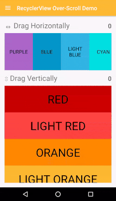

# Over-Scroll Support For RecyclerView, ListView, GridView, ScrollView ...
 
The library provides an iOS-like over-scrolling effect for many Android native views, and allows
for easy expansion to support custom views as well.



# Gradle Dependency

Add the following to your module's `build.gradle` file:

```groovy
dependencies {
    // ...
    compile 'me.everything:overscroll-android:1.0.0'
}
```

# Usage

### RecyclerView

```java
RecyclerView recyclerView = (RecyclerView) findViewById(R.id.recycler_view);
    
// Horizontal
OverScrollDecoratorHelper.setUpOverScroll(recyclerView, OverScrollDecoratorHelper.ORIENTATION_HORIZONTAL);
// Vertical
OverScrollDecoratorHelper.setUpOverScroll(recyclerView, OverScrollDecoratorHelper.ORIENTATION_VERTICAL);
```

### ListView

```java
ListView listView = (ListView) findViewById(R.id.list_view);
OverScrollDecoratorHelper.setUpOverScroll(listView);
```

### GridView

```java
GridView gridView = (GridView) findViewById(R.id.grid_view);
OverScrollDecoratorHelper.setUpOverScroll(gridView);
```

### ScrollView, HorizontalScrollView

```java
ScrollView scrollView = (ScrollView) findViewById(R.id.scroll_view);
OverScrollDecoratorHelper.setUpOverScroll(scrollView);
    
HorizontalScrollView horizontalScrollView = (HorizontalScrollView) findViewById(R.id.horizontal_scroll_view);
OverScrollDecoratorHelper.setUpOverScroll(horizontalScrollView);
```

### Any View (Always Over-Scroll Ready)

```java
View view = fragmentView.findViewById(R.id.demo_view);
    
// Horizontal
OverScrollDecoratorHelper.setUpStaticOverScroll(view, OverScrollDecoratorHelper.ORIENTATION_HORIZONTAL);
// Vertical
OverScrollDecoratorHelper.setUpStaticOverScroll(view, OverScrollDecoratorHelper.ORIENTATION_VERTICAL);
```

# Advanced Usage

```java
// Horizontal RecyclerView
RecyclerView recyclerView = (RecyclerView) findViewById(R.id.recycler_view);
new HorizontalOverScrollBounceEffectDecorator(new RecyclerViewOverScrollDecorAdapter(recyclerView));

// ListView (vertical)
ListView listView = (ListView) findViewById(R.id.list_view);
new VerticalOverScrollBounceEffectDecorator(new AbsListViewOverScrollDecorAdapter(listView));
```
    
## Custom Views

```java
public class CustomView extends View {
    // ...
}
    
final CustomView view = (CustomView) findViewById(R.id.custom_view);
new VerticalOverScrollBounceEffectDecorator(new IOverScrollDecoratorAdapter() {

    @Override
    public View getView() {
        return view;
    }

    @Override
    public boolean isInAbsoluteStart() {
	    // canScrollUp() is an example of a method you must implement
        return !view.canScrollUp();
    }

    @Override
    public boolean isInAbsoluteEnd() {
	     // canScrollDown() is an example of a method you must implement
        return !view.canScrollDown();
    }
});
```
